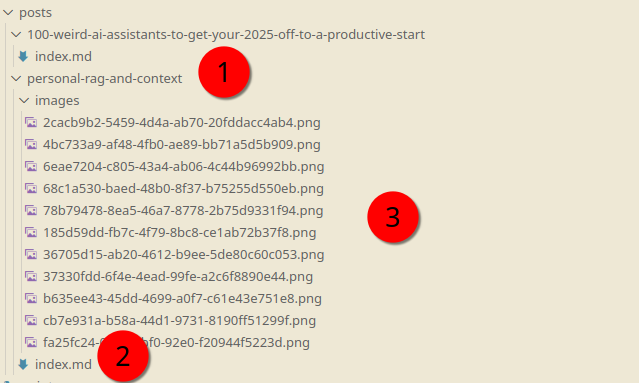

# Hashnode Backup Script With Images

## The Problem

[Hashnode](https://www.hashnode.com) is a great blogging service and has a nice Github action for syncing your posts to a repository as a backup mechanism. However,  at the time of writing, the backup mechanism does not extract the images from the CDN. 

I "wrote" this backup script using Claude Sonnet 3.5 and after a few iterations I got it to work. 

The script will copy your Hashnode blog posts over to a target directory and pulls the images out of the CDN (to prevent it attempting to copy SVGs, I added some specificity for the type of file it would regard as an image; If you use SVGs commonly for images, then modify the script.).

## How To Run

- Copy the script (`backup-script.py`)
- Rename `example.env` as `.env`
- Replace it with your values. 

You'll need your Hashnode token.

## Use Case Statement

## Author

Daniel Rosehill  
(public at danielrosehill dot com)

## Licensing

This repository is licensed under CC-BY-4.0 (Attribution 4.0 International) 
[License](https://creativecommons.org/licenses/by/4.0/)

### Summary of the License
The Creative Commons Attribution 4.0 International (CC BY 4.0) license allows others to:
- **Share**: Copy and redistribute the material in any medium or format.
- **Adapt**: Remix, transform, and build upon the material for any purpose, even commercially.

The licensor cannot revoke these freedoms as long as you follow the license terms.

#### License Terms
- **Attribution**: You must give appropriate credit, provide a link to the license, and indicate if changes were made. You may do so in any reasonable manner, but not in any way that suggests the licensor endorses you or your use.
- **No additional restrictions**: You may not apply legal terms or technological measures that legally restrict others from doing anything the license permits.

For the full legal code, please visit the [Creative Commons website](https://creativecommons.org/licenses/by/4.0/legalcode).